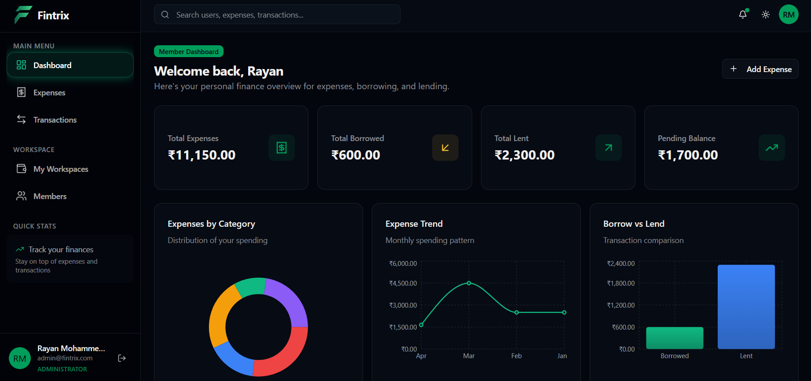
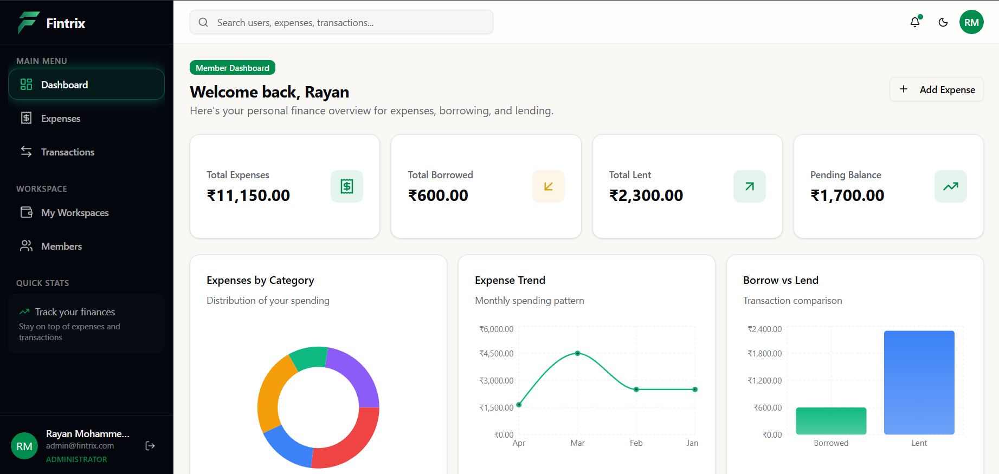
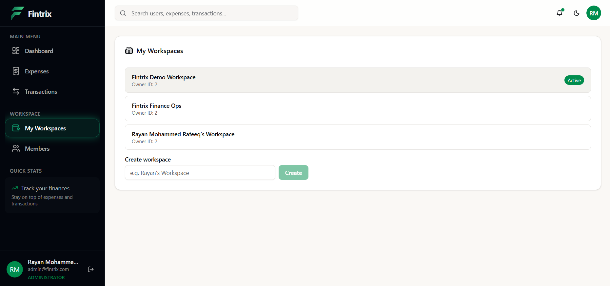
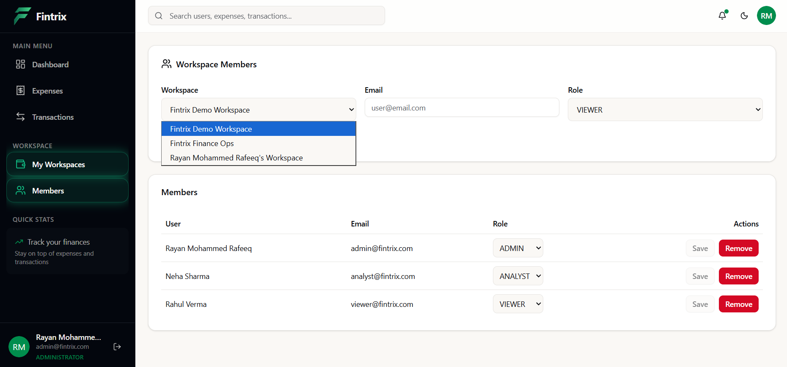
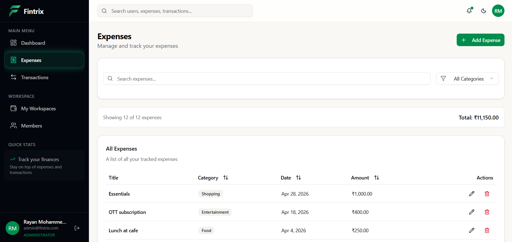
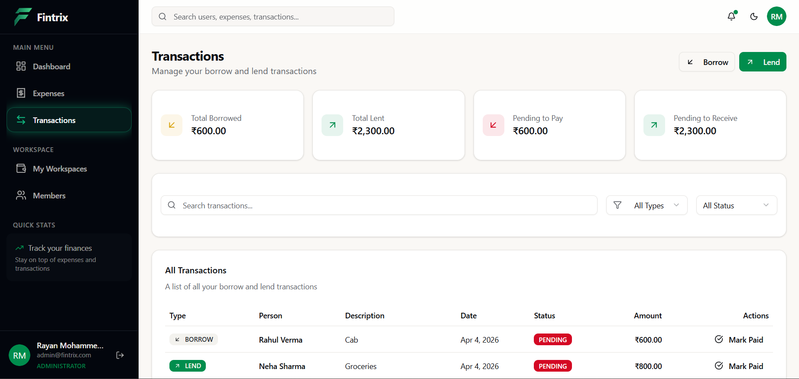

# Backend cold start (Render free tier)

**Note:** The backend is hosted on Render (free tier) and may take **~1–2 minutes** (sometimes up to **~3 minutes**) to spin up on the first request after inactivity. Once active, responses are fast.

---
<p align="center">
  
</p>

<h1 align="center">Fintrix</h1>

Full-stack finance management platform for tracking expenses and transactions in **workspace-based** accounts with **role-based access control (RBAC)**.

**Backend:** Spring Boot (JWT secured REST API) · **Frontend:** React (Vite) · **DB:** PostgreSQL (Neon)

**Live:** https://fintrix-web.vercel.app/ · **API:** https://fintrix-app-backend.onrender.com

> Note: The backend is hosted on Render (free tier) and may take ~1–2 minutes to spin up on the first request. Once active, responses are fast.

**Repository:** https://github.com/Rayan-Mohammed-Rafeeq/fintrix

> Monorepo: see [`backend/`](./backend) and [`frontend/`](./frontend).

---

## Why this project (Assessment Fit)

Fintrix was built to closely match common backend assessment requirements around **API design, data modeling, validation, business logic, and access control**.

How it maps to the evaluation checklist:

- **User & Role Management**: users, roles (Admin/Analyst/Viewer), workspace membership
- **Financial Records Management**: expense/transaction lifecycle, filtering and listing
- **Dashboard Summary APIs**: server-side aggregates for totals and summaries
- **Access Control**: JWT + RBAC + workspace-scoped authorization
- **Validation & Error Handling**: request validation and consistent HTTP status codes
- **Data Persistence**: PostgreSQL (local Docker + hosted Neon)
- **Documentation**: Swagger/OpenAPI + repo README

## Project Overview

Fintrix helps individuals or small teams manage finances in a structured way:

- **Workspaces** isolate data per group/team (multi-tenant-by-design).
- **Roles** (Admin / Analyst / Viewer) enforce who can manage members vs analyze vs view.
- **Expenses & transactions** are captured as workspace-scoped records.
- **Dashboards** provide totals and summaries to quickly understand spending trends.

The system is designed around a clean separation of concerns (controller → service → repository) and workspace-scoped authorization.

---

## Quick Test (2 minutes)

1. Open: https://fintrix-web.vercel.app/
2. Login using demo credentials below
3. Create or explore a workspace
4. Add expenses / view dashboard trends

---
## Demo Credentials

Use the following accounts to explore the application with different roles:

- **Admin**  
  Email: admin@fintrix.com  
  Password: Admin123  
  *(Rayan Mohammed Rafeeq – full access)*

- **Analyst**  
  Email: analyst@fintrix.com  
  Password: Analyst123  
  *(Neha Sharma – can create and analyze data)*

- **Viewer**  
  Email: viewer@fintrix.com  
  Password: Viewer123  
  *(Rahul Verma – read-only access)*

---

> A demo workspace with pre-populated financial data (expenses, transactions, and trends) is available for quick evaluation.

## Features

- **Role-Based Access Control (RBAC)**: Admin, Analyst, Viewer
- **Workspace-based multi-tenant architecture** (data isolated per workspace)
- **Expense tracking** (CRUD) and **transaction management**
- **Borrow/Lend flows** with validation (members must belong to the same workspace)
- **Dashboard analytics** (totals, summaries, trends; aggregated server-side)
- **Secure authentication** with **JWT**
- **Forgot password / reset password** flow

---

## System Architecture

Deployment flow:

```
React (Vercel)  -->  Spring Boot API (Render)  -->  PostgreSQL (Neon)
```


- Controller: handles requests
- Service: business logic + RBAC
- Repository: database layer
- Security: JWT + authorization

Swagger:  
https://fintrix-app-backend.onrender.com/swagger-ui.html
---

## Tech Stack

### Backend

- Java 17
- Spring Boot (Spring Web, Spring Security, Spring Data JPA)
- JWT authentication (JJWT)
- OpenAPI / Swagger UI (springdoc)

### Frontend

- React + TypeScript
- Vite
- Axios + TanStack Query (server-state)

### Database

- PostgreSQL (local via Docker Compose, production on Neon)

### Deployment

- Backend: Render
- Frontend: Vercel
- Database: Neon (managed Postgres)

---

## Project Structure

```
fintrix/
  backend/        # Spring Boot REST API
  frontend/       # React (Vite) client
```

### Backend internals (high level)

Typical package responsibilities (verify exact names in `backend/src/main/java`):

- `controller/` – HTTP endpoints (auth, workspaces, members, expenses, transactions, summary)
- `service/` – business rules and orchestration
- `repository/` – Spring Data JPA repositories
- `entity/` – JPA entities (User, Workspace, Membership, Expense, Transaction, ...)
- `dto/` – request/response DTOs
- `security/` – JWT filters, security configuration, authorization helpers
- `config/` – app configuration and bootstrapping
- `enums/` – role types, domain enums

### Frontend internals (high level)

- `src/api/` – API client modules (Axios)
- `src/pages/` – route pages
- `src/components/` – reusable UI components
- `src/store/` / `src/contexts/` – auth + shared state
- `src/hooks/` – data and UI hooks

---

## How It Works (End-to-End)

### 1) Authentication (registration / login)

1. User registers or logs in via `/api/v1/auth/*`.
2. Backend returns a **JWT**.
3. Frontend stores the token and sends it on subsequent requests (typically via `Authorization: Bearer <token>`).

### 2) Role-based access control enforcement

- Routes are protected by Spring Security.
- RBAC rules are enforced on endpoints (and/or at service level).
- Workspace-scoped endpoints additionally verify the caller is a member of that workspace and has sufficient permissions.

RBAC at a glance:

| Capability | Viewer | Analyst | Admin |
|---|:---:|:---:|:---:|
| View dashboard summaries | ✓ | ✓ | ✓ |
| Read records (expenses/transactions) | ✓ | ✓ | ✓ |
| Filter/search records | ✓ | ✓ | ✓ |
| Create/update/delete records | ✗ | ✗ / limited* | ✓ |
| Manage members / roles | ✗ | ✗ | ✓ |

\*Exact analyst permissions may vary by endpoint; see Swagger UI for the authoritative rules.

### 3) Workspace creation and membership

- A user can create a **workspace**.
- Admins can manage members (add/remove/update role).
- Membership is the foundation for **tenant isolation**: all core finance data is workspace-scoped.

### 4) Expense & transaction lifecycle

- **Expenses** and **transactions** are created, updated, and queried within a workspace context.
- The backend validates ownership and membership to prevent cross-workspace access.

### 5) Borrow/Lend validation logic

- Borrow/Lend operations ensure that:
  - The involved users are **members of the same workspace**.
  - The transaction transitions (e.g., paying/settling) are valid.

### 6) Dashboard aggregation logic

- Dashboard endpoints compute aggregates server-side (totals, summaries, and time-based rollups).
- This keeps the frontend thin and avoids shipping large raw datasets for basic analytics.

---

## API Overview

The API is organized under `/api/v1` and grouped by feature area:

- **Auth**: register, login, forgot password, reset password
- **Workspaces**: create/list workspaces
- **Workspace Members**: invite/list/update role/remove members
- **Workspace Expenses**: CRUD expenses within a workspace
- **Workspace Transactions**: borrow/lend/list/pay lifecycle
- **Summary / Dashboard**: totals and aggregated analytics per workspace

For the full, up-to-date contract, use Swagger UI locally (`/swagger-ui.html`).

### API Example (Login)

```bash
curl -X POST "https://fintrix-app-backend.onrender.com/api/v1/auth/login" \
  -H "Content-Type: application/json" \
  -d '{"email":"<your-email>","password":"<your-password>"}'
```

### Quick API walkthrough (happy path)

1) **Register / Login** → receive JWT

2) **Create a workspace**

3) **Add members** + assign roles (admin-only)

4) **Create expenses / borrow / lend** inside the workspace

5) **Fetch dashboard summaries** for totals and trends

---

## Deployment

### Backend (Render)

- Build and deploy the Spring Boot service.
- Configure Render environment variables (DB + JWT + CORS + frontend URL).
- Ensure the service can reach Neon Postgres.

### Frontend (Vercel)

- Deploy the Vite build.
- Set `VITE_API_BASE_URL` to the Render backend URL.

Deployed URLs:

- Frontend: https://fintrix-web.vercel.app/
- Backend: https://fintrix-app-backend.onrender.com

### Database (Neon)

- Create a Neon Postgres database.
- Use the Neon connection string values for `DB_URL`, `DB_USERNAME`, and `DB_PASSWORD`.

---


## Screenshots / Demo

Dashboard and core flows (from `frontend/public/`):

### Dashboard

| Dark | Light |
|---|---|
|  |  |

### Workspaces & Members

| Workspaces | Members & Roles |
|---|---|
|  |  |

### Finance

| Expenses | Transactions |
|---|---|
|  |  |

---

## Key Highlights

- **Workspace isolation**: prevents cross-tenant access by design
- **Secure RBAC**: role checks + workspace membership validation
- **Clean architecture**: controllers keep HTTP concerns separate from business logic and persistence

---

## Future Improvements

- Notifications (email + in-app)
- Mobile application
- Advanced analytics (budgeting, forecasting, anomaly detection)
- Audit logs for admin actions
- Improved reporting exports (CSV/PDF)

---

## Assumptions & Design Notes

- **Workspace isolation** is the primary tenant boundary: all core finance data is workspace-scoped.
- **RBAC is enforced server-side** (not just in the UI), and workspace endpoints validate membership.
- **Aggregations run on the backend** so the frontend can remain thin and fast.

Tradeoffs kept intentionally simple for an assessment-style project:

- Summary/reporting endpoints can be extended with pagination/caching for very large datasets.
- Email delivery for password reset may require SMTP configuration in production.

---

## Design Highlights

- **Tenant boundary:** Workspace ID is the primary isolation boundary for all finance data.
- **Server-side authorization:** RBAC and workspace membership checks are enforced in the backend.
- **Clean layering:** Controllers handle HTTP, services own business rules, repositories handle persistence.
- **Reliable workflows:** Borrow/lend operations validate membership + state transitions to prevent invalid updates.
- **Analytics strategy:** Dashboard endpoints expose aggregates (not raw dumps) to keep clients fast.


